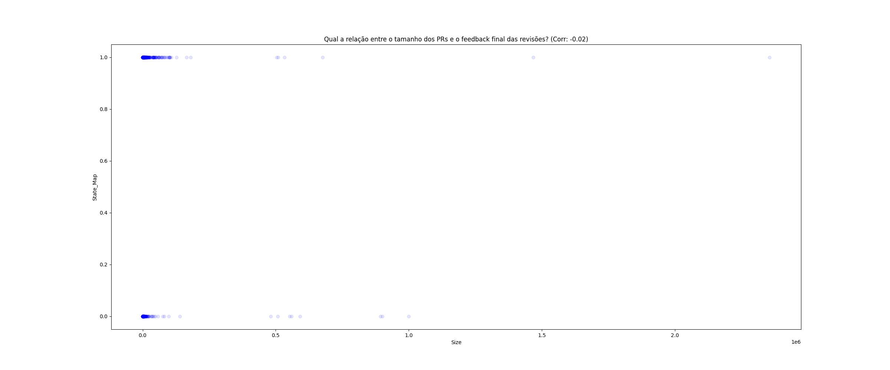
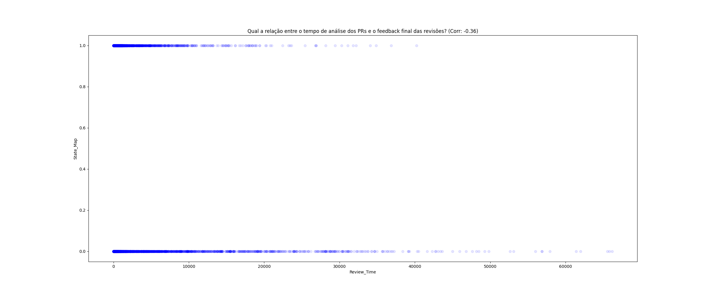
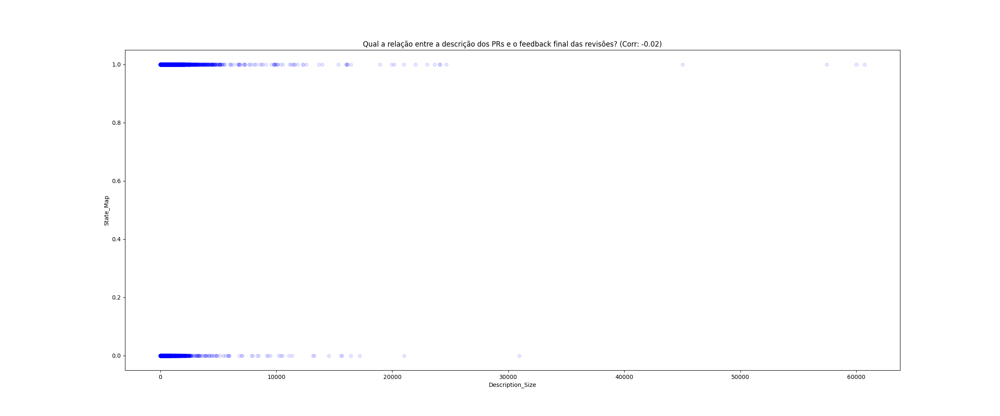
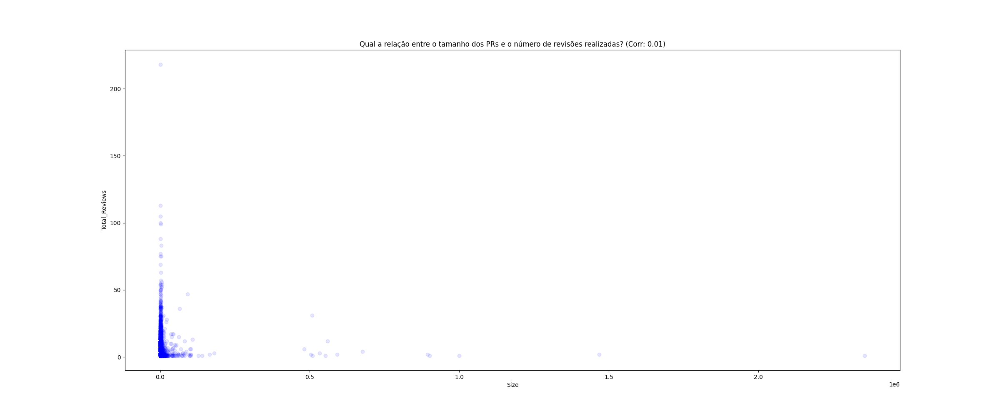
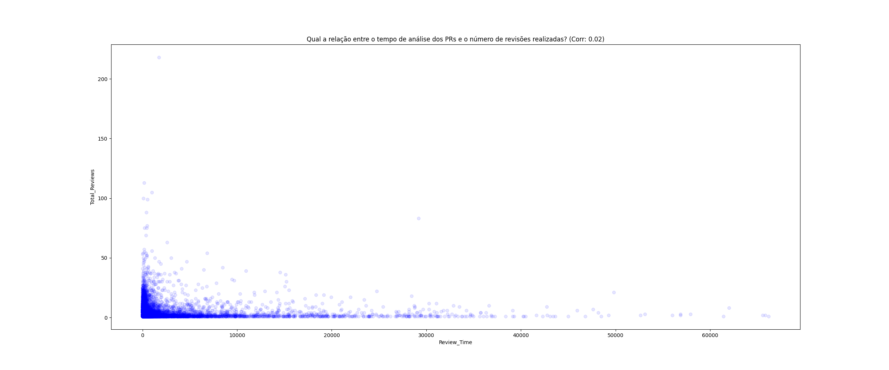
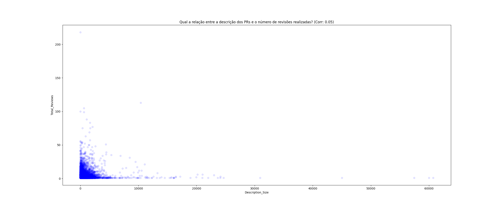
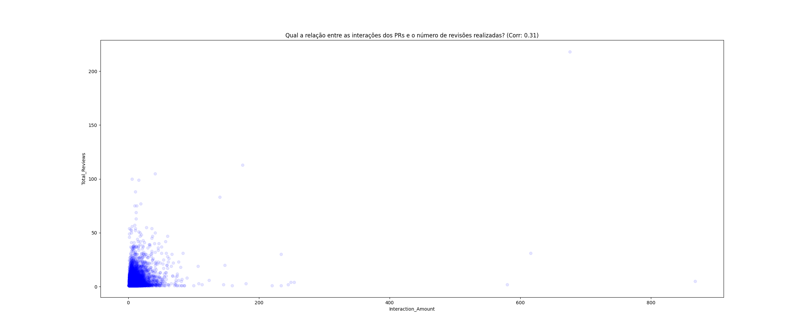

# LAB 3 -  Caracterizando a atividade de code review no github

## i. Introdução

Neste trabalho são analisados 200 dos repositórios mais populares disponíveis no Github, sendo estes ordenados de acordo com a sua quantidade de *stars*. O intuito é caracterizar a atividade de code review exercida nas *pull requests* de cada repositório.

## ii. Metodologia

Para realizar este trabalho foi criado um algoritmo que realiza a busca dos repositórios mais populares do Github utilizando sua interface GraphQL em intervalos de 100 repositórios por vez. Após o retorno inicial, é realizada a validação para selecionar apenas os repositórios com 100 ou mais *pull requests*. 

Após essa filtragem inicial, é executada a query que retorna os dados sobre as 100 próximas *pull requests* de cada repositório, sendo esta etapa realizada até serem encontradas 100 *pull requests*  ou até todas as *pull requests* do repositório serem carregadas. Nesta etapa são adicionadas apenas os itens que possuam pelo menos 1 *review* realizada. Durante este processo todos os resultados são armazenados sobre a pasta `data`.

Em sequência é executado o *script* `summarize_selected_prs.py`, que sumariza todos os dados obtidos em cada repositório no arquivo `concatenated-pr-data.json`. Após isso os dados são carregados em um DataFrame para realizar o calculo dos valores de cada uma das RQs abordadas e o resultado é salvo em `concatenated-pr-data.csv`.

Nesta etapa também são calculados os coeficientes de Spearman e tais dados são salvos nos arquivos `correlation-values.json` e `summarized-median-data.json`. O teste de correlação de Spearman foi escolhido pois, em conjunto com os gráficos, ilustra bem a maneira como as métricas análisadas variam para *pull requests* fechadas em comparação à aquelas em que foi realizado o *merge*.

Por fim, é executado o *script* `generate_charts.py`, que carrega todos os dados gerados no passo anterior e gera os gráficos de dispersão para cada pergunta abordada na próxima sessão.

## iii. Resultados

Inicialmente são levantadas as hipoteses a seguir:
- *Pull requests* que terminaram com seu *merge* realizado terão um maior número de *reviews*
- *Pull requests* que foram fechadas terão maior tempo de duração de *review*
- *Pull requests* maiores terão maior tempo de duração de *review*

### A. Feedback Final das Revisões (Status do PR):

#### RQ 01. Qual a relação entre o tamanho dos PRs e o feedback final das revisões?

O valor de correlação entre o tamanho dos PRs e o feedback final é consideravelmente baixo, sendo visivel pelo gráfico, onde de forma geral a distribuição do tamanho dos PRs é bem similar tanto para aqueles que foram fechados quanto para aqueles em que foi feito o *merge*.

#### RQ 02. Qual a relação entre o tempo de análise dos PRs e o feedback final das revisões?

 

Nesta questão é observado que os PRs que foram fechados de forma geral possuem uma maior quantidade de itens em que o número de horas gastos em sua análise, o que é refletido no valor do indice de correlação.

#### RQ 03. Qual a relação entre a descrição dos PRs e o feedback final das revisões?

O valor de correlação entre o tamanho da descrição dos PRs e o feedback final é consideravelmente baixo, sendo visivel pelo gráfico, onde de forma geral a distribuição do tamanho das descrições dos PRs é bem similar tanto para aqueles que foram fechados quanto para aqueles em que foi feito o *merge*.

#### RQ 04. Qual a relação entre as interações nos PRs e o feedback final das revisões?

O valor de correlação entre a quantidade de interações dos PRs e o feedback final é consideravelmente baixo, sendo visivel pelo gráfico, onde de forma geral a distribuição da quantidade de interações dos PRs é bem similar tanto para aqueles que foram fechados quanto para aqueles em que foi feito o *merge*.

### B. Número de Revisões:

#### RQ 05. Qual a relação entre o tamanho dos PRs e o número de revisões realizadas?

O valor de correlação entre o tamanho das PRs e o número de revisões realizadas é consideravelmente baixo, sendo visivel pelo gráfico, onde de forma geral o tamanho não influencia na sua quantidade de reviews, pois é possivel ver que até mesmo aqueles itens com um tamanho pequeno possuem também um número alto de reviews.

#### RQ 06. Qual a relação entre o tempo de análise dos PRs e o número de revisões realizadas?

O valor de correlação entre o tempo de análise das PRs e o número de revisões realizadas é consideravelmente baixo, sendo visivel pelo gráfico, onde até mesmo aqueles PRs com baixo número de reviews pode possuir um grande tempo de análise.

Também é possível perceber que aqueles PRs com maior número de reviews geralmente possuem menor tempo de análise.

#### RQ 07. Qual a relação entre a descrição dos PRs e o número de revisões realizadas?

Ao análisar o gráfico é notável que não há grande correlação entre o tamanho da descrição de um *pull request* com o seu número de *reviews*.

#### RQ 08. Qual a relação entre as interações nos PRs e o número de revisões realizadas?

 !

## iv. Conclusão

De forma geral não há muita correlação entre as questões levantadas, com algumas exceções como o número de revisões em correlação ao número de interações, o tempo de análise dependendo do estado do PR (MERGED/CLOSED).

